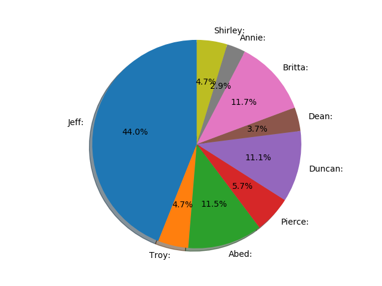

# community-script-reader
Reads pilot episode of "Community". Prints a pie chart of how many words each character spoke.
## Output

## Setup
1. `pip install matplotlib`
2. `py .\community_gender.py`